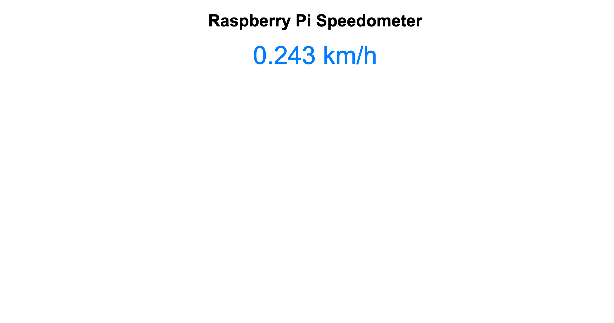

# Raspberry Pi Speedometer using Flask and Sense HAT



## Overview

This project is a simple yet impressive speedometer built using a Raspberry Pi and a Sense HAT. It measures the speed using the accelerometer data from the Sense HAT and displays the speed in real-time on a web interface created with Flask. The speed is calculated in kilometers per hour (km/h) and can be accessed from any device on the same network as the Raspberry Pi.

## Features

- **Real-time Speed Calculation:** Measures speed using the Sense HAT's accelerometer and updates the speed in real-time.
- **Web Interface:** Displays the current speed on a clean, user-friendly web page.
- **Flask Application:** The project is built as a Flask web application, making it accessible from any device with a web browser.

## Hardware Requirements

- **Raspberry Pi** (any model with internet access)
- **Sense HAT**
- **MicroSD card** (with Raspberry Pi OS installed)
- **Power supply for Raspberry Pi**

## Software Requirements

- **Python 3.x**
- **Flask** (`pip install Flask`)
- **Sense HAT Python Library** (pre-installed on Raspberry Pi OS; if not, install using `sudo apt-get install sense-hat`)

## Setup Instructions

1. **Hardware Setup:**
   - Attach the Sense HAT to the Raspberry Pi’s GPIO pins.

2. **Software Setup:**
   - Ensure your Raspberry Pi is connected to the internet.
   - Install Flask if it's not already installed:
     ```bash
     pip install Flask
     ```
   - Ensure the Sense HAT library is installed:
     ```bash
     sudo apt-get install sense-hat
     ```

3. **Clone or Download the Project:**
   - Clone this repository or download the files to your Raspberry Pi.

4. **Run the Application:**
   - Navigate to the directory containing `app.py` and run the Flask application:
     ```bash
     python app.py
     ```
   - The Flask application will start, and you should see an output similar to:
     ```
     * Running on http://0.0.0.0:5000/ (Press CTRL+C to quit)
     ```
   
5. **Access the Speedometer:**
   - On any device connected to the same network as your Raspberry Pi, open a web browser and go to:
     ```
     http://<your_pi_ip_address>:5000
     ```
   - The speedometer will display the current speed in kilometers per hour (km/h).

## Project Files

- **app.py:** The main Python script containing the Flask application and speed calculation logic.
- **templates/index.html:** The HTML file for the web interface, displayed when you access the speedometer in a browser.

## How It Works

- The Flask application continuously reads accelerometer data from the Sense HAT, calculates the resultant speed, and converts it to km/h.
- The speed is updated at a regular interval and made available via a `/speed` API endpoint.
- The web interface uses JavaScript to fetch the latest speed from the Flask server and display it on the page in real-time.

## Customization

- **Update Interval:** You can change the `UPDATE_INTERVAL` constant in `app.py` to adjust how often the speed is updated.
- **Scale Factor:** Modify the `SCALE_FACTOR` constant to adjust the sensitivity of the speed calculation.

## Troubleshooting

- **No Data on the Webpage:** Ensure the Flask application is running and accessible from your device's browser.
- **Incorrect Speed Values:** Try adjusting the `SCALE_FACTOR` to better calibrate the speedometer for your specific use case.

## License

This project is licensed under the MIT License. See the [LICENSE](LICENSE) file for more details.

## Acknowledgments

- This project was built using the [Flask](https://flask.palletsprojects.com/) web framework and the [Sense HAT](https://www.raspberrypi.org/products/sense-hat/) Python library.
